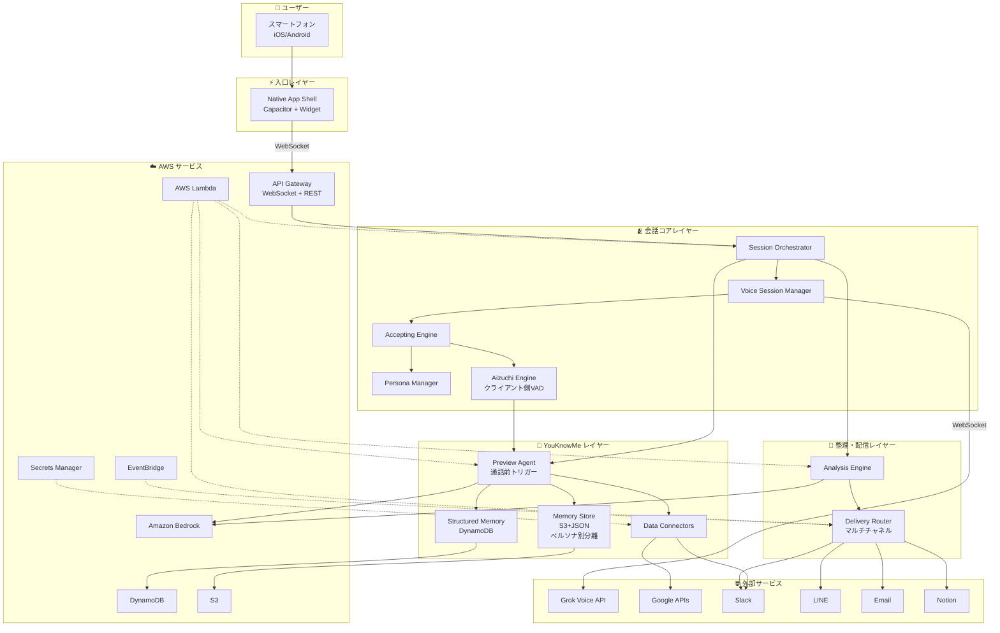

# Application Design — 統合ドキュメント

## 概要

gutitto のアプリケーション設計を統合的に記述する。本ドキュメントは以下の個別設計書の要約・統合版である:

- `components.md` — コンポーネント定義と責務
- `component-methods.md` — メソッドシグネチャ
- `services.md` — サービス層とオーケストレーション
- `component-dependency.md` — 依存関係
- `consistency-feasibility-review.md` — 矛盾・実現可能性レビュー
- `consistency-questions.md` — レビュー解決質問と回答

---

## 設計原則

### 3本柱とレイヤーの対応

gutitto の 3本柱がアーキテクチャのレイヤー構造に直接マッピングされる:

| レイヤー | 3本柱 | 責務 |
|---------|------|------|
| **入口レイヤー** | ⚡ ゼロUX | Capacitor ハイブリッドネイティブアプリ。ロック画面/ホーム画面ウィジェットから1タップ起動 |
| **会話コアレイヤー** | 🫂 受け止める力 | リアルタイム音声セッション、受容応答制御（事前プロンプトのみ）、相槌（クライアント側VAD）・自発発話 |
| **YouKnowMe レイヤー** | 🧠 あなたを知っていること | 予習エージェント（通話前トリガーのみ）、階層記憶（S3+JSON、ペルソナ別分離）、構造化メモリ、データ連携 |
| **整理・配信レイヤー** | 🫂 受け止める力（裏側） | 会話後の自動分析、マルチチャネル配信 |

### 設計判断の根拠（consistency-review 反映版）

| 判断 | 理由 |
|------|------|
| **Capacitor ハイブリッドネイティブ採用** | 純粋 PWA では iOS ロック画面ウィジェット・Siri 等が実装不可。Capacitor で Web コードを再利用しつつ、ウィジェット・Widget Extension へブリッジ可能 |
| **予習エージェントを通話前トリガーのみで実行** | 定期実行はコスト・複雑度過剰。通話しない限り予習結果は使わない |
| **Accepting Engine をプロンプト構築に特化** | 実時間で LLM 応答を抑制することは技術的に不可能。事前プロンプトで品質担保 |
| **Knowledge Graph → Structured Memory に簡略化** | MVP では Bedrock プロンプトで十分。グラフ構造は決勝追加 |
| **Vector DB を MVP では不採用** | OpenSearch Serverless は最低 $350/月。S3+JSON+キーワード検索で MVP 成立 |
| **長期記憶は要約＋メタデータのみ恒久保存** | 生データ恒久保存はコスト爆発＆プライバシーリスク |
| **ペルソナ別に会話履歴を分離** | "まなみに話したことをげんぞうが知っている" の違和感回避。共通データ（予習情報）は共有 |
| **マルチプロバイダ抽象化** | Voice Session Manager が Grok/OpenAI/Gemini を差替え可能に |
| **配信先をマルチチャネル化** | Slack固定は情シス規程と衝突する懸念。LINE/Email/Calendar/Notion を選択可能に |
| **1.5秒 MVP 目標 / 1秒 Stretch Goal** | Grok + Lambda プロキシ環境で現実的な数値 |

---

## アーキテクチャ全体図

---

## コンポーネント数と規模感

| レイヤー | コンポーネント数 | AWS サービス |
|---------|-------------|------------|
| 入口 | 1（Native App Shell）+ Widget Extension | TestFlight/Play Store 配布 |
| 会話コア | 4（VSM, AE, PM, AIZ） | Lambda + API Gateway WebSocket + DynamoDB |
| YouKnowMe | 4（PA, MS, SM, DC） | Lambda + S3 + DynamoDB |
| 整理・配信 | 2（AN, DR） | Lambda + EventBridge |
| **合計** | **11 コンポーネント** | — |

**Note**: MVP では Vector DB・OpenSearch 不使用。決勝フェーズで Pinecone / pgvector 追加予定。

---

## MVP（Must 5本）に必要なコンポーネント

| Must Story | 必須コンポーネント |
|-----------|-----------------|
| 1.1 ロック画面1タップ起動 | Native App Shell（Widget 含む） |
| 2.1 AIから話しかけてくれる | Voice Session Manager, Accepting Engine, Preview Agent |
| 2.2 整理されていない愚痴を受け止める | Accepting Engine, Persona Manager |
| 2.3 沈黙時の相槌/話題提供 | Aizuchi Engine, Preview Agent, Structured Memory |
| 4.1 複数データソース統合 | Preview Agent, Data Connectors, Memory Store, Structured Memory |

**MVP 必須コンポーネント**: Native App Shell, Voice Session Manager, Accepting Engine, Persona Manager, Aizuchi Engine, Preview Agent, Data Connectors, Memory Store, Structured Memory（**9/11 コンポーネント**）

**決勝追加コンポーネント**: Analysis Engine, Delivery Router（2/11）

**決勝追加機能**: Vector DB + RAG、本格的 Knowledge Graph、Android 版、Siri ショートカット、ロック画面クイックアクション、Live Activity / Apple Watch

---

## Unit 分解への示唆（次ステージへの申し送り）

Application Design の結果、以下の Unit 分割が自然に導かれる:

| Unit 候補 | 含むコンポーネント | ジャーニー位置 | 3本柱 |
|----------|-----------------|-------------|------|
| **入口 Unit** | Native App Shell, Widget Extension | Pre-call | ⚡ ゼロUX |
| **会話 Unit** | Voice Session Manager, Accepting Engine, Persona Manager, Aizuchi Engine | In-call | 🫂 受容 |
| **予習 Unit** | Preview Agent, Data Connectors, Memory Store, Structured Memory | Pre-call + In-call | 🧠 YouKnowMe |
| **整理・配信 Unit** | Analysis Engine, Delivery Router | Post-call | 🫂 受容（裏側） |

この4 Unit 構成は:
- **ユーザージャーニー軸**（Pre/In/Post）で位置が明確
- **3本柱**でそれぞれの価値が説明可能
- **チーム3人**で並行開発可能（入口+会話=フロント担当 / 予習=バックエンド+AI担当 / 整理配信=インフラ担当）
- **実現可能性レビュー済み**（矛盾・コスト過剰要素を排除）

詳細は Units Generation ステージで確定する。

---

## 実装技術スタック（予選 MVP）

| レイヤー | 採用技術 |
|---------|---------|
| フロント | **Capacitor**（HTML/CSS/JS）+ iOS WidgetKit（Swift）+ Android AppWidgetProvider（Kotlin） |
| 音声AI | **Grok Voice API**（xAI Realtime） |
| バックエンド | AWS Lambda + API Gateway WebSocket + DynamoDB + S3 + Bedrock |
| 配布 | **Apple TestFlight**（予選プレゼン向け実機デモ） |
| 観測 | CloudWatch Logs |

**決勝追加**: Android + Play Store、Vector DB（Pinecone/pgvector）、Knowledge Graph 本格化、Siri/App Intents、Live Activity、Apple Watch
