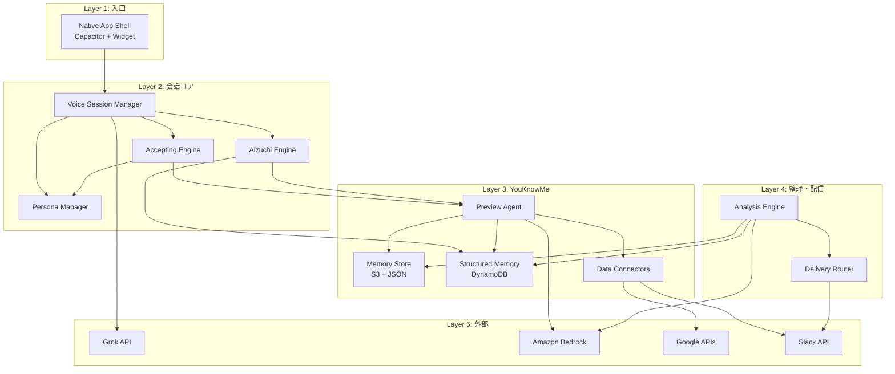

# Component Dependency

gutitto のコンポーネント間依存関係を定義する。

---

## 依存関係マトリクス

| From ↓ / To → | NativeApp | VoiceSM | AcceptEng | PersonaMgr | AizuchiEng | PreviewAgent | MemoryStore | StructMem | DataConn | AnalysisEng | DeliveryRouter |
|---|---|---|---|---|---|---|---|---|---|---|---|
| **Native App** | — | ✅ | | | | | | | | | |
| **Voice Session Mgr** | | — | ✅ | ✅ | ✅ | ✅ | | | | | |
| **Accepting Engine** | | | — | ✅ | ✅ | ✅ | | | | | |
| **Persona Manager** | | | | — | | | | | | | |
| **Aizuchi Engine** | | | | | — | ✅ | | ✅ | | | |
| **Preview Agent** | | | | | | — | ✅ | ✅ | ✅ | | |
| **Memory Store** | | | | | | | — | | | | |
| **Structured Memory** | | | | | | | | — | | | |
| **Data Connectors** | | | | | | | | | — | | |
| **Analysis Engine** | | | | | | | ✅ | ✅ | | — | ✅ |
| **Delivery Router** | | | | | | | | | | | — |

---

## 依存関係図（レイヤー別）

---

## 通信パターン

| パターン | 使用箇所 | 技術 |
|---------|---------|-----|
| **同期 WebSocket** | Native App ↔ Voice Session Manager ↔ Grok API | WebSocket (API Gateway WebSocket) |
| **同期 REST** | Native App → Persona Manager (CRUD) | API Gateway REST |
| **非同期イベント** | 通話終了 → Analysis Engine → Delivery Router | EventBridge / SQS |
| **通話前トリガー** | 通話開始 → Preview Agent | Lambda invoke（Session Orchestrator から） |
| **スケジュール** | 翌朝リマインダー | EventBridge Scheduler |
| **ストリーム** | 音声データ（PCM16 双方向） | WebSocket binary frames |

---

## 依存の方向性ルール

1. **上位レイヤーは下位レイヤーに依存する**（L1→L2→L3→L4）
2. **同一レイヤー内の横依存は最小化する**（例: Aizuchi Engine は Accepting Engine に依存しない）
3. **外部サービス（L5）への依存は抽象化インターフェースを経由する**（マルチプロバイダ対応）
4. **循環依存を禁止する**

---

## 変更影響分析

| コンポーネント変更 | 影響範囲 | 影響度 |
|----------------|---------|------|
| Grok API 仕様変更 | Voice Session Manager のみ（抽象化済み） | 低 |
| ペルソナ JSON スキーマ変更 | Persona Manager → Accepting Engine → Voice Session Manager | 中 |
| 新データソース追加 | Data Connectors に追加のみ（Preview Agent は変更不要） | 低 |
| 配信先追加 | Delivery Router に追加のみ | 低 |
| 記憶スキーマ変更 | Memory Store → Preview Agent, Analysis Engine | 中 |
| 受容ルール変更 | Accepting Engine のプロンプトのみ | 低 |
| ペルソナ別記憶分離の変更 | Memory Store（プレフィックス設計） → Preview Agent | 低 |
| Vector DB 導入（決勝） | Memory Store 内部実装の拡張（インターフェース互換） | 低 |
