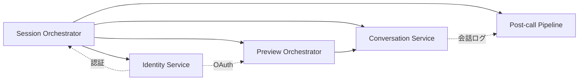

# Services

gutitto のサービス層を定義する。各サービスはコンポーネント間のオーケストレーションを担い、ユーザージャーニーの各フェーズを実現する。

---

## サービス一覧

| サービス名 | 責務 | ジャーニー位置 | 3本柱 |
|-----------|------|-------------|------|
| **Session Orchestrator** | 通話セッションのライフサイクル管理（開始→会話→終了→後処理） | 全体 | 🔄 横断 |
| **Preview Orchestrator** | 通話前の予習パイプライン実行（データ収集→要約→プロンプト注入） | Pre-call | 🧠 YouKnowMe |
| **Conversation Service** | 通話中のリアルタイム応答制御（受容＋相槌＋自発発話の統合） | In-call | 🫂 受容 |
| **Post-call Pipeline** | 通話後の分析→分類→配信パイプライン | Post-call | 🫂 受容 |
| **Identity Service** | 認証・セッション永続化・ゼロ摩擦ログイン | 横断 | ⚡ ゼロUX |

---

## サービス詳細

### Session Orchestrator

通話セッション全体のライフサイクルを管理する最上位サービス。

**オーケストレーションフロー**:
```
1. [起動] PWA Client → Session Orchestrator: 通話開始リクエスト
2. [予習] Session Orchestrator → Preview Orchestrator: 予習実行指示
3. [接続] Session Orchestrator → Voice Session Manager: Grok API セッション確立
4. [注入] Preview Orchestrator → Voice Session Manager: 予習コンテキストをプロンプトに注入
5. [会話] Voice Session Manager ↔ Grok API: リアルタイム音声ストリーム
6. [終了] PWA Client → Session Orchestrator: 通話終了
7. [後処理] Session Orchestrator → Post-call Pipeline: 会話ログを渡して分析開始
8. [保存] Session Orchestrator → Memory Store: 会話履歴を階層記憶に保存
```

**関連コンポーネント**: Voice Session Manager, Preview Agent, Analysis Engine, Memory Store

---

### Preview Orchestrator

**通話前トリガー**で実行される予習パイプライン。定期バッチ実行は行わない（コスト・複雑度抑制のため）。

**オーケストレーションフロー**:
```
1. [トリガー] 通話開始イベント（Session Orchestrator から発火）
2. [並列収集] Data Connectors → Google Calendar / Slack / Gmail / 過去会話（並列実行）
3. [要約] 収集データ → Bedrock: エンティティ抽出・要約生成
4. [更新] 要約結果 → Structured Memory: 人物・イベント・タスクエンティティ更新
5. [保存] 要約結果 → Memory Store（ペルソナ別プレフィックス）: 短期記憶に格納
6. [注入準備] 直近＋関連情報を選択 → プロンプト注入用コンテキスト生成
7. [完了] NFR-Performance-3（5秒以内）で Session Orchestrator に通知
```

**関連コンポーネント**: Preview Agent, Data Connectors, Bedrock, Memory Store, Structured Memory

**設計判断**: MVP では Knowledge Graph の本格実装を省略し、Bedrock プロンプトに要約を詰める方式で成立させる。

---

### Conversation Service

通話中のリアルタイム応答品質を制御するサービス。Accepting Engine + Aizuchi Engine + Persona Manager を統合する。

**オーケストレーションフロー**:
```
1. [セッション確立] Voice Session Manager → Conversation Service: セッション開始通知
2. [プロンプト構築] Accepting Engine: 受容ルール + ペルソナ設定 + 予習情報 → 統合プロンプト
3. [挨拶] Conversation Service → Voice Session Manager: AI挨拶指示（予習反映）
4. [会話ループ]
   a. ユーザー発話 → Grok API → AI応答
   b. 沈黙検出 → Aizuchi Engine: 段階的応答選択（待つ/相槌/話題提供）
   c. 指示語検出 → Knowledge Graph: 文脈ショートカット解釈
5. [終了] 通話終了イベント → 会話ログ確定
```

**関連コンポーネント**: Accepting Engine, Aizuchi Engine, Persona Manager, Voice Session Manager, Knowledge Graph

---

### Post-call Pipeline

通話終了後に非同期で実行される分析・配信パイプライン。

**オーケストレーションフロー**:
```
1. [トリガー] 通話終了イベント
2. [分析] Analysis Engine → Bedrock: 会話全文をマトリクス分類
3. [生成] Analysis Engine: アクションプラン・日報サマリ生成
4. [配信] Delivery Router: ユーザー設定に基づきマルチチャネル配信（Slack個人workspace/LINE/Email/Calendar/Notion/アプリ内）
5. [スケジュール] Delivery Router → EventBridge: 翌朝リマインダー設定
6. [記憶更新] Analysis Engine → Memory Store: 要約のみ長期記憶にマーキング（ペルソナ別プレフィックス）
7. [構造化メモリ更新] Analysis Engine → Structured Memory: 新規エンティティ追加
```

**関連コンポーネント**: Analysis Engine, Delivery Router, Memory Store, Structured Memory, Bedrock

---

### Identity Service

認証とセッション管理を担い、ゼロUX原則（ログイン摩擦ゼロ）を実現する。

**オーケストレーションフロー**:
```
1. [初回] ユーザー登録/ログイン → セッショントークン発行 + リフレッシュトークン永続化
2. [再訪] アプリ起動 → リフレッシュトークン検証 → 自動ログイン（ダイアログなし）
3. [ロック画面起動] デバイスのロック解除状態に追従（ネイティブOSの生体認証に委譲）
4. [OAuth管理] Data Connectors 用の OAuth トークン管理（Google/Slack）。初回同意画面はゼロUX原則の例外として許容
```

**関連コンポーネント**: Native App Shell, Data Connectors, Secrets Manager

---

## サービス間の依存関係



**依存の方向**:
- Session Orchestrator が全体を統括
- Preview Orchestrator は Conversation Service にコンテキストを供給
- Post-call Pipeline は Conversation Service の出力（会話ログ）を消費
- Identity Service は全サービスの認証基盤
