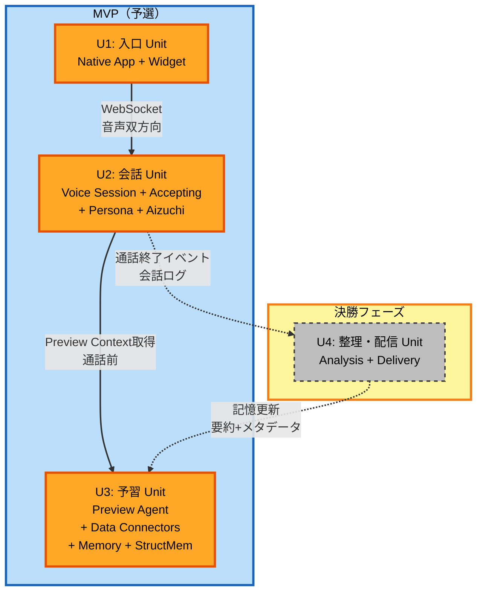

# Unit of Work Dependency

gutitto の 4 Unit 間の依存関係を定義する。

---

## 依存関係マトリクス

| From ↓ / To → | U1 入口 | U2 会話 | U3 予習 | U4 整理・配信 |
|--------------|---------|---------|---------|--------------|
| **U1 入口** | — | ✅ WebSocket | | |
| **U2 会話** | | — | ✅ コンテキスト取得 | ✅ 通話ログ配信 |
| **U3 予習** | | | — | |
| **U4 整理・配信** | | | ✅ 記憶更新 | — |

**凡例**:
- `WebSocket` = リアルタイム音声セッション
- `コンテキスト取得` = 予習情報のプロンプト注入
- `通話ログ配信` = 通話終了時の会話ログを後処理へ
- `記憶更新` = 分析結果を記憶にフィードバック

---

## 依存関係図



---

## Unit 間インターフェース契約

### U1 ⇄ U2: 音声セッション

**方向**: U1 → U2 (WebSocket)

**インターフェース**:
- WebSocket URL: `wss://{api-gateway-endpoint}/voice`
- メッセージタイプ（抜粋）:
  - `session.start` — 通話開始（ペルソナID・ユーザーID）
  - `audio.chunk` — PCM16 音声チャンク（双方向）
  - `session.end` — 通話終了

**契約**:
- U1 はネイティブOSのマイク権限・音声再生を担う
- U2 は Grok API への認証・プロキシを担う
- U1 は session.end の後、U2 の終了通知を待つ（3秒タイムアウト）

### U2 → U3: 予習コンテキスト取得

**方向**: U2 → U3 (Lambda invoke / Direct call)

**インターフェース**:
- 関数呼び出し: `previewAgent.getContextForSession(userId, personaId)`
- 返却: `SessionContext` 構造体（予習サマリ、直近記憶、人物エンティティ）

**契約**:
- U2 は通話開始時に 1回だけ呼び出す
- U3 は NFR-Performance-3（5秒以内）で返却
- 返却タイムアウト時、U2 はデフォルトプロンプト（予習なし）で継続

### U2 → U4: 通話ログ配信（決勝）

**方向**: U2 → U4 (EventBridge)

**インターフェース**:
- イベント名: `ConversationEnded`
- ペイロード: `{ userId, personaId, conversationLog, timestamp }`

**契約**:
- U2 は通話終了時にイベントを発火
- U4 は非同期で処理（通話体験に影響しない）

### U4 → U3: 記憶更新（決勝）

**方向**: U4 → U3 (直接 Memory Store API 経由)

**インターフェース**:
- Memory Store の `saveLongTerm(userId, personaId, episode)`
- Structured Memory の `addEntity(userId, entity)`

**契約**:
- U4 は分析結果を要約化して U3 の記憶に書き戻す
- 生データ全文は保存しない（要約のみ恒久保存）

---

## 開発順序（Update Strategy）

### Phase 1: 並行開発可能（MVP フェーズ）

```
U1 入口 Unit    ──┐
                 │
U2 会話 Unit    ──┼─── 並行作業可能（独立実装）
                 │
U3 予習 Unit    ──┘
```

**理由**: Unit 間インターフェース契約が明確なので、モックで繋いで並行作業可能。

### Phase 2: 統合（予選プレゼン直前）

```
U1 + U2 + U3 ───> 統合テスト ───> TestFlight配布
```

### Phase 3: 決勝フェーズ

```
U4 整理・配信 Unit を追加 ───> U2/U3 とイベント連携 ───> 決勝デモ
```

---

## Critical Path（MVP）

MVP Must 5本を動かすための必須依存チェーン:

```
U1 (1.1 ロック画面1タップ)
  ↓ WebSocket
U2 (2.1 AIから挨拶, 2.2 受容, 2.3 相槌・自発発話)
  ↓ getContextForSession
U3 (4.1 データソース統合) 
```

**クリティカルパス**: U1 → U2 → U3 の**同期チェーン**が通話 1本を成立させる。どの Unit が欠けても MVP は成立しない。

---

## 変更影響分析（Unit レベル）

| 変更内容 | 影響 Unit | 影響度 |
|---------|---------|------|
| Grok API の仕様変更 | U2 のみ | 低 |
| ペルソナ JSON スキーマ変更 | U2（Persona Manager） + U3（会話履歴のペルソナ紐づけ）| 中 |
| 新データソース追加（Slack新ワークスペース等） | U3 のみ | 低 |
| ウィジェット UI 変更 | U1 のみ | 低 |
| 配信先追加（LINE以外） | U4 のみ | 低 |
| 3本柱の再定義 | 全 Unit | 高（設計やり直し） |

---

## Module Update Strategy

- **Update Approach**: Parallel（並行開発）
- **Critical Path**: 統合段階で U1 ⇄ U2 ⇄ U3 の動作確認
- **Coordination Points**:
  - WebSocket メッセージフォーマット（U1 ⇄ U2）
  - SessionContext 構造（U2 ⇄ U3）
  - ペルソナ JSON スキーマ（U2 ⇄ U3）
- **Testing Checkpoints**:
  - 各 Unit の単体動作（モック相手）
  - U1+U2 で実通話成立
  - U1+U2+U3 で予習反映確認（MVP完成）
- **Rollback Strategy**: 各 Unit 独立デプロイなので、問題 Unit のみロールバック可能
