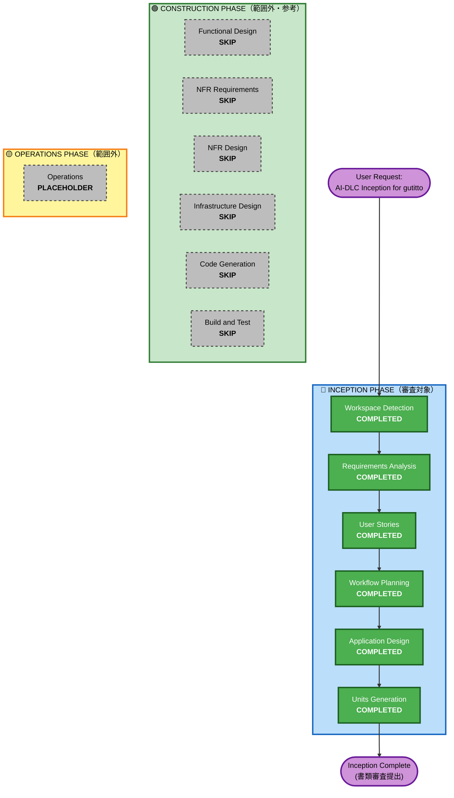

# Execution Plan

## Detailed Analysis Summary

### Project Type and Scope
- **Project Type**: Greenfield（新規プロダクト定義）
- **Primary Output**: ハッカソン書類審査向け `aidlc-docs/` 一式（Inception フェーズ全体）
- **Transformation Type**: 新規プロダクトの Inception 整備
- **Primary Changes**: 要件・ユーザーストーリー・アプリケーション設計・Unit of Work 計画の策定

### Change Impact Assessment
- **User-facing changes**: Yes — PWA/ネイティブ 通話UI、アンビエントウィジェット、ロック画面起動、ペルソナ切替 等
- **Structural changes**: Yes — 予習エージェント・会話コア・整理配信を分離するサーバーレス志向アーキ
- **Data model changes**: Yes — ペルソナ JSON、会話履歴、ユーザー知識グラフ（MVPは簡易）、階層記憶
- **API changes**: Yes — REST + WebSocket（Grok Realtime プロキシ）+ Slack/Google OAuth コールバック
- **NFR impact**: Yes — 1.5秒 MVP / 1秒 Stretch の遅延目標、フルサーバーレス、マルチプロバイダ抽象化、ゼロUX 横断制約

### Component Relationships（論理コンポーネント）
- **入口コンポーネント**: Capacitor ネイティブアプリ、ウィジェット（iOS WidgetKit / Android AppWidgetProvider）
- **会話コアコンポーネント**: Grok Voice API プロキシ、ペルソナ適用、受容応答制御
- **予習コンポーネント**: 予習エージェント、カレンダー/Slack/Gmail 連携、階層記憶、構造化メモリ
- **整理・配信コンポーネント**: Bedrock 会話分析、マトリクス分類、マルチチャネル配信
- **横断コンポーネント**: 認証・セッション、セキュリティ、設定画面、ペルソナ CRUD

### Risk Assessment
- **Risk Level**: Medium
- **Rollback Complexity**: Easy（ハッカソン提出はドキュメント中心、実装は予選後に整備）
- **Testing Complexity**: Moderate（音声リアルタイム＋多ソース統合＋エージェント型）

### Hackathon-Specific Constraints
- **Submission Deadline**: 2026-05-10（書類審査） / 予選プレゼン（日程未確定）
- **Mandatory Deliverables**: `aidlc-docs/inception/` 配下の要件・ストーリー・設計・Unit of Work 4点セット
- **AI-DLC Workflow Usage**: 必須（使用プロセスが審査対象）

---

## Workflow Visualization

---

## Phases Executed

### 🔵 INCEPTION PHASE

- [x] **Workspace Detection** — COMPLETED
  - **Rationale**: 常に実行するフェーズ。プロジェクトタイプを判定
- [x] **Requirements Analysis** — COMPLETED
  - **Rationale**: 常に実行するフェーズ。17+4+1 の質問で要件を詳細化
- [x] **User Stories** — COMPLETED
  - **Rationale**: 複数ステークホルダー・3本柱・ハッカソン審査のため必須。プライマリ1 + ネガティブ1 のペルソナで 15 ストーリー
- [x] **Workflow Planning** — COMPLETED（本ドキュメント）
  - **Rationale**: 常に実行するフェーズ
- [x] **Application Design** — COMPLETED
  - **Rationale**: ハッカソン必須成果物。新規コンポーネント（予習エージェント、会話コア、整理・配信）の高レベル設計が不可欠。審査員は "なぜこの分割か" を重視するため、コンポーネントとその関係性を明確化
- [x] **Units Generation** — COMPLETED
  - **Rationale**: ハッカソン必須成果物。"Unit of Work 計画" は書類審査の生命線。ユーザージャーニー軸 × ビジネス価値軸のハイブリッドで Unit を分割し、並行開発性と審査訴求を両立

### 🟢 CONSTRUCTION PHASE — 今回のスコープ外

- [ ] **Functional Design** — SKIP
  - **Rationale**: Inception のみが提出対象のため。Application Design で定義する高レベル仕様で書類審査は成立する
- [ ] **NFR Requirements** — SKIP
  - **Rationale**: requirements.md 内に NFR 記述済み。Construction フェーズで per-unit に深掘りする想定（予選通過後）
- [ ] **NFR Design** — SKIP
  - **Rationale**: 同上
- [ ] **Infrastructure Design** — SKIP
  - **Rationale**: 決勝進出時にAWS デプロイ向けで必要。予選は Application Design でのクラウドサービスマッピング概要レベルで十分
- [ ] **Code Generation** — SKIP
  - **Rationale**: 予選デモ実装は別途進める
- [ ] **Build and Test** — SKIP
  - **Rationale**: 同上

### 🟡 OPERATIONS PHASE — PLACEHOLDER

- [ ] **Operations** — PLACEHOLDER
  - **Rationale**: 将来の拡張枠

---

## Estimated Timeline

- **Inception 完了済み**（全6ステージ完走）
- **Target Deadline**: 2026-05-10（書類審査提出期限）

---

## Success Criteria

### Primary Goal
ハッカソン書類審査で「Unit分解の適切さ・なぜこう分けたか」の説明性を最大化する Inception 成果物を完成させる。

### Key Deliverables
- `aidlc-docs/inception/requirements/requirements.md` — **完了**
- `aidlc-docs/inception/user-stories/stories.md` + `personas.md` — **完了**
- `aidlc-docs/inception/application-design/*.md` — **完了**
  - `components.md`
  - `component-methods.md`
  - `services.md`
  - `component-dependency.md`
  - `application-design.md`（統合）
- `aidlc-docs/inception/application-design/unit-of-work.md` + 関連ドキュメント — **完了**
  - `unit-of-work.md`
  - `unit-of-work-dependency.md`
  - `unit-of-work-story-map.md`

### Quality Gates

- [x] 全ての要件が 3本柱（R-Accept / R-Entry / R-YouKnowMe）のいずれかにマッピング可能
- [x] 全ての Must ストーリー（5本）が Application Design で担当コンポーネントに割り当てられる
- [x] Unit分解がユーザージャーニー軸 × ビジネス価値軸で説明可能
- [x] ハッカソン審査員への "なぜこの分割か" の回答が自明になっている
- [x] 矛盾・実現可能性レビュー完了（consistency-feasibility-review.md）

---

## Hackathon-Specific Unit Decomposition Axis

Application Design / Units Generation で採用した分解軸:

**主軸: ユーザージャーニー**
- 予習（Pre-call）
- 会話体験（In-call）
- 整理・配信（Post-call）
- 横断（Cross-cutting）

**副軸: ビジネス価値（3本柱）**
- 柱1: 受け止める力
- 柱2: ゼロUX
- 柱3: あなたを知っていること（You-Know-Me）

各 Unit は「ユーザージャーニー上のどこに位置するか」と「3本柱のどれを主に支えるか」の2軸で説明できるように構成。詳細は `aidlc-docs/inception/application-design/unit-of-work.md` を参照。
